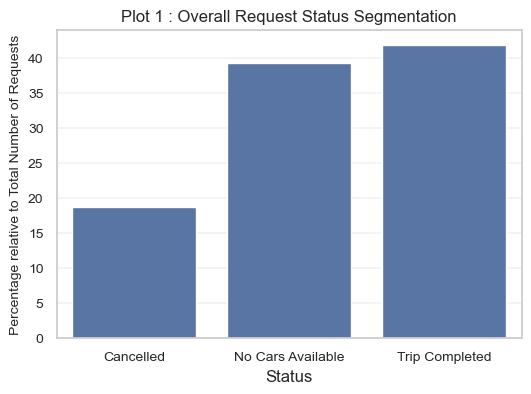
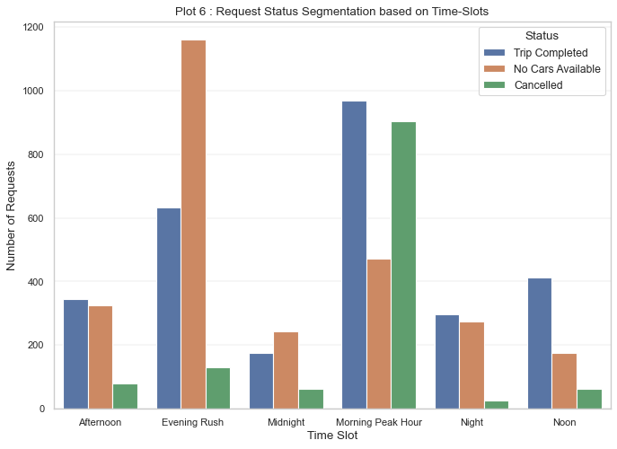
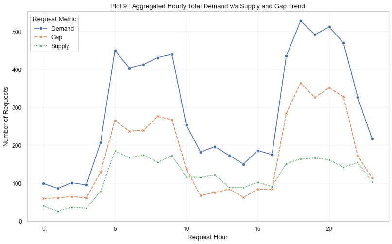
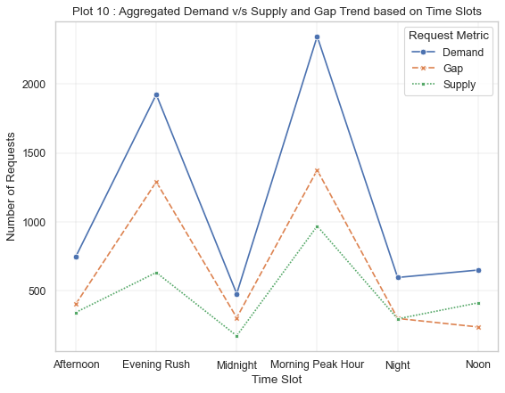

Uber Supply-Demand Gap Analysis

Exploratory data analysis of 6,745 Uber ride requests to find when and where demand goes unmet and to recommend ways to close the supply-demand gap.

Business Problem

When a rider requests a cab and the trip is cancelled or no car is available, Uber loses revenue and the customer. This project answers:

What share of requests goes unfulfilled?
Which time slots and pickup points (City vs Airport) have the biggest gap between supply and demand?
What is driving the gap, and what can Uber do about it?
Dataset
Source: Uber Supply-Demand Gap on Kaggle
File: Uber Request Data.csv, 6,745 requests from 11 to 15 July 2016
Columns: Request id, Pickup point (City / Airport), Driver id, Status (Trip Completed / Cancelled / No Cars Available), Request timestamp, Drop timestamp
Missing Driver id (2,650 rows) belongs to No Cars Available requests, and missing Drop timestamp (3,914 rows) belongs to No Cars Available and Cancelled requests. These blanks are expected because no trip took place.
Approach
Loaded the data and checked data types and missing values
Converted timestamps to datetime (dayfirst=True)
Engineered features: request date, hour, weekday and time slot (Morning Peak Hour, Noon, Afternoon, Evening Rush, Night, Midnight)
Defined Demand = all requests, Supply = completed trips, Gap = Demand - Supply
Analysed the gap by hour, time slot and pickup point, using 12 plots
Summarised findings and recommendations
Key Results
Status	Requests	Share
Trip Completed	2,831	41.97%
No Cars Available	2,650	39.29%
Cancelled	1,264	18.74%

58% of all requests (3,914) went unfulfilled.

Show Image

Gap by time slot
Time slot	Demand	Supply	Gap
Morning Peak Hour	2,346	970	1,376
Evening Rush	1,924	633	1,291
Afternoon	748	344	404
Midnight	479	174	305
Night	597	297	300
Noon	651	413	238

Morning Peak Hour and Evening Rush together account for about 68% of all unfulfilled requests.

Show Image Show Image

Two different problems
	Morning Peak, City to Airport	Evening Rush, Airport to City
Requests	1,845	1,492
Gap	1,310 (71%)	1,193 (80%)
Main cause	Cancellations (873 requests)	No cars available (1,106 requests)

Overall, 2,003 City requests (57%) and 1,911 Airport requests (59%) were denied. Airport is slightly worse overall, but the picture changes by time of day. There is almost no variation by day of the week, so the problem is about the time of day, not the weekday.

Recommendations
Morning, City to Airport: offer drivers incentives or guaranteed fares for airport trips to reduce cancellations.
Evening, Airport to City: bring more drivers to the airport before the evening flight peak (incentives, driver waiting area, surge pricing).
Monitor: track the gap percentage by time slot and pickup point on a daily dashboard.
Limitations
Only five days of data from one month
No flight, weather, price or driver-location data, so the likely causes above are reasoned from the patterns, not proven
Time-slot boundaries are a design choice and could shift the numbers slightly
Tech Stack

Python, Pandas, NumPy, Matplotlib, Seaborn, Jupyter Notebook

How to Run
bash
git clone https://github.com/shaz-code/Uber-Supply-Demand-Gap-Analysis.git
cd Uber-Supply-Demand-Gap-Analysis
pip install -r requirements.txt
jupyter notebook

Open Uber Supply Demand Gap Analysis Project.ipynb and choose Kernel > Restart Kernel and Run All Cells. Keep Uber Request Data.csv in the same folder as the notebook.

Project Structure
├── images/                 # charts used in this README
├── Uber Request Data.csv
├── Uber Supply Demand Gap Analysis Project.ipynb
├── requirements.txt
└── README.md

## Author

**Shahil Ahmed MF**

[GitHub](https://github.com/shaz-code) · 786shahilahmed@gmail.com

